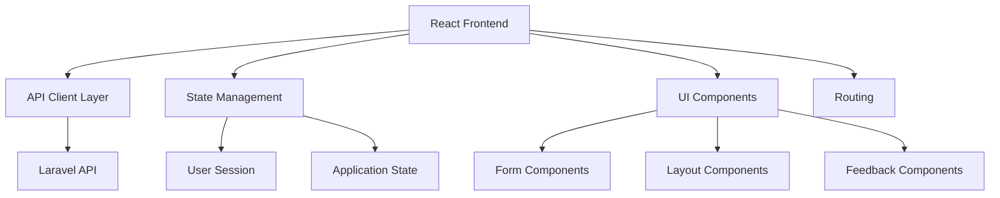

# Design Document

## Overview

The OSC Pelesenan Frontend is a modern web application built with React and TypeScript that provides a user-friendly interface for all Module M01 functionality. The design emphasizes clean UI/UX, responsive design, and seamless integration with the existing Laravel API.

## Architecture

### High-Level Architecture



### Technology Stack

- **Frontend Framework**: React 18 with TypeScript
- **Build Tool**: Vite for fast development and optimized builds
- **Styling**: Tailwind CSS for utility-first styling
- **State Management**: React Context + useReducer for global state
- **HTTP Client**: Axios for API communication
- **Routing**: React Router v6 for client-side routing
- **Form Handling**: React Hook Form with validation
- **UI Components**: Headless UI for accessible components

## Components and Interfaces

### Page Components

#### AuthPages
- **LoginPage**: Email/password form with validation
- **RegisterPage**: Full registration form with IC number
- **Layout**: Centered card design with OSC branding

#### DashboardPage
- **UserInfo**: Display user details and verification status
- **QuickActions**: Cards for common actions (verify identity, manage companies)
- **RecentActivity**: List of recent user actions from audit logs

#### IdentityVerificationPage
- **VerificationForm**: IC number input with validation
- **StatusDisplay**: Current verification status with visual indicators
- **ResultFeedback**: Success/failure messages with next steps

#### CompanyManagementPage
- **CompanyVerification**: SSM number verification form
- **CompanyLinking**: Interface to link verified companies
- **MyCompanies**: List of user's linked companies
- **AdminCompanyList**: All companies view for admin users

#### AccountSettingsPage
- **ProfileSettings**: View and edit user information
- **SecuritySettings**: Password change and session management
- **AccountDeactivation**: Deactivation process with confirmation

### Shared Components

#### Layout Components
```typescript
interface LayoutProps {
  children: React.ReactNode;
  title?: string;
  showNavigation?: boolean;
}

// AppLayout: Main application wrapper with navigation
// AuthLayout: Centered layout for login/register
// DashboardLayout: Sidebar navigation with main content area
```

#### Form Components
```typescript
interface FormFieldProps {
  label: string;
  name: string;
  type?: 'text' | 'email' | 'password';
  validation?: ValidationRules;
  error?: string;
}

// FormField: Reusable input field with validation
// SubmitButton: Button with loading states
// FormCard: Styled form container
```

#### Feedback Components
```typescript
interface AlertProps {
  type: 'success' | 'error' | 'warning' | 'info';
  message: string;
  dismissible?: boolean;
}

// Alert: Styled alert messages
// LoadingSpinner: Loading indicators
// ConfirmDialog: Confirmation modals
```

### API Client Layer

#### ApiClient
```typescript
class ApiClient {
  private baseURL: string;
  private token: string | null;

  // Authentication
  async register(data: RegisterData): Promise<AuthResponse>
  async login(credentials: LoginCredentials): Promise<AuthResponse>
  async logout(): Promise<void>

  // Identity Verification
  async verifyIdentity(icNo: string): Promise<VerificationResponse>

  // Company Management
  async verifyCompany(ssmNo: string): Promise<CompanyResponse>
  async linkCompany(companyId: number): Promise<CompanyResponse>
  async getMyCompanies(): Promise<Company[]>
  async getAllCompanies(): Promise<Company[]> // Admin only

  // Account Management
  async deactivateAccount(): Promise<void>
}
```

#### Type Definitions
```typescript
interface User {
  id: number;
  name: string;
  email: string;
  ic_no: string;
  status_verified_person: boolean;
  role: 'PEMOHON' | 'PENTADBIR_SYS';
}

interface Company {
  id: number;
  ssm_no: string;
  name: string;
  status: 'active' | 'inactive' | 'unknown';
  owner_user_id: number | null;
}

interface AuthResponse {
  user: User;
  token: string;
}
```

## User Interface Design

### Design System

#### Color Palette
- **Primary**: Blue (#3B82F6) - Government/official theme
- **Secondary**: Green (#10B981) - Success states
- **Warning**: Amber (#F59E0B) - Caution states
- **Error**: Red (#EF4444) - Error states
- **Neutral**: Gray scale for text and backgrounds

#### Typography
- **Headings**: Inter font family, bold weights
- **Body**: Inter font family, regular weight
- **Code**: Mono font for technical data (IC numbers, SSM numbers)

#### Spacing
- Consistent 8px grid system
- Component padding: 16px, 24px, 32px
- Section margins: 32px, 48px, 64px

### Page Layouts

#### Authentication Pages
```
┌─────────────────────────────────────┐
│           OSC Pelesenan             │
│                                     │
│  ┌─────────────────────────────┐    │
│  │        Login Form           │    │
│  │  Email: [____________]      │    │
│  │  Password: [_________]      │    │
│  │  [Login Button]             │    │
│  │  Link to Register           │    │
│  └─────────────────────────────┘    │
└─────────────────────────────────────┘
```

#### Dashboard Layout
```
┌─────────────────────────────────────┐
│ Header: OSC Pelesenan | User | Logout│
├─────────────────────────────────────┤
│ Welcome, [User Name]                │
│ Status: [Verified/Unverified]      │
│                                     │
│ ┌─────────┐ ┌─────────┐ ┌─────────┐ │
│ │ Verify  │ │ Company │ │Account  │ │
│ │Identity │ │ Mgmt    │ │Settings │ │
│ └─────────┘ └─────────┘ └─────────┘ │
│                                     │
│ Recent Activity:                    │
│ • Identity verified                 │
│ • Company linked                    │
└─────────────────────────────────────┘
```

#### Company Management Interface
```
┌─────────────────────────────────────┐
│ Company Management                  │
├─────────────────────────────────────┤
│ Verify Company:                     │
│ SSM No: [____________] [Verify]     │
│                                     │
│ Verification Result:                │
│ ✓ Active: Tech Solutions Sdn Bhd    │
│ [Link to My Account]                │
│                                     │
│ My Companies:                       │
│ • Tech Solutions Sdn Bhd (Active)  │
│ • Digital Corp (Inactive)          │
└─────────────────────────────────────┘
```

## State Management

### Global State Structure
```typescript
interface AppState {
  user: User | null;
  isAuthenticated: boolean;
  isLoading: boolean;
  error: string | null;
  companies: Company[];
  verificationStatus: {
    identity: boolean;
    lastVerified: Date | null;
  };
}

interface AppActions {
  LOGIN_SUCCESS: { user: User; token: string };
  LOGIN_FAILURE: { error: string };
  LOGOUT: {};
  SET_LOADING: { loading: boolean };
  SET_ERROR: { error: string | null };
  UPDATE_VERIFICATION: { verified: boolean };
  SET_COMPANIES: { companies: Company[] };
}
```

### Context Providers
```typescript
// AuthContext: User authentication state
// CompanyContext: Company management state
// NotificationContext: Toast notifications and alerts
```

## Routing Structure

### Public Routes
- `/` - Landing page with login/register options
- `/login` - Login form
- `/register` - Registration form

### Protected Routes (require authentication)
- `/dashboard` - Main user dashboard
- `/identity` - Identity verification page
- `/companies` - Company management page
- `/companies/verify` - Company verification form
- `/companies/link` - Company linking interface
- `/settings` - Account settings
- `/settings/deactivate` - Account deactivation

### Admin Routes (require PENTADBIR_SYS role)
- `/admin/companies` - All companies management
- `/admin/users` - User management (future)
- `/admin/audit` - Audit log viewer (future)

## API Integration

### HTTP Client Configuration
```typescript
// Base configuration
const apiClient = axios.create({
  baseURL: '/api',
  timeout: 10000,
  headers: {
    'Content-Type': 'application/json',
    'Accept': 'application/json',
  },
});

// Request interceptor for auth token
apiClient.interceptors.request.use((config) => {
  const token = localStorage.getItem('auth_token');
  if (token) {
    config.headers.Authorization = `Bearer ${token}`;
  }
  return config;
});

// Response interceptor for error handling
apiClient.interceptors.response.use(
  (response) => response,
  (error) => {
    if (error.response?.status === 401) {
      // Redirect to login
      localStorage.removeItem('auth_token');
      window.location.href = '/login';
    }
    return Promise.reject(error);
  }
);
```

### Error Handling Strategy
```typescript
interface ApiError {
  message: string;
  errors?: Record<string, string[]>; // Validation errors
  status: number;
}

// Centralized error handling
const handleApiError = (error: AxiosError): ApiError => {
  if (error.response?.status === 422) {
    return {
      message: 'Validation failed',
      errors: error.response.data.errors,
      status: 422,
    };
  }
  
  return {
    message: error.response?.data?.message || 'An error occurred',
    status: error.response?.status || 500,
  };
};
```

## User Experience Flow

### Registration Flow
1. User visits landing page
2. Clicks "Register" → Registration form
3. Fills form with validation feedback
4. Submits → Loading state → Success/Error
5. Success → Auto-login → Dashboard

### Identity Verification Flow
1. User on dashboard sees "Unverified" status
2. Clicks "Verify Identity" → Verification page
3. Enters IC number → Submits
4. Shows result → Updates dashboard status

### Company Management Flow
1. User clicks "Manage Companies" → Company page
2. Enters SSM number → Verifies company
3. Shows company details → Option to link
4. Links company → Updates "My Companies" list

### Account Deactivation Flow
1. User goes to Settings → Account tab
2. Clicks "Deactivate Account" → Confirmation dialog
3. Confirms → Processing → Success message
4. Auto-logout → Redirect to landing page

## Security Considerations

### Authentication
- JWT tokens stored in localStorage with expiration
- Automatic token refresh on API calls
- Logout on token expiration
- Protected route guards

### Input Validation
- Client-side validation mirrors API validation
- XSS prevention through proper escaping
- CSRF protection via Laravel Sanctum
- Input sanitization for display

### Data Protection
- Sensitive data (IC numbers) masked in UI
- Secure token storage and transmission
- No sensitive data in browser history
- Proper error message sanitization

## Performance Optimization

### Code Splitting
- Route-based code splitting for smaller bundles
- Lazy loading of non-critical components
- Dynamic imports for admin features

### Caching Strategy
- API response caching for user data
- Browser caching for static assets
- Service worker for offline capability (future)

### Bundle Optimization
- Tree shaking for unused code elimination
- Asset optimization and compression
- CDN integration for static assets

## Accessibility

### WCAG 2.1 Compliance
- Semantic HTML structure
- Proper ARIA labels and roles
- Keyboard navigation support
- Screen reader compatibility
- Color contrast compliance

### Inclusive Design
- Clear visual hierarchy
- Consistent navigation patterns
- Error messages in multiple formats
- Loading states with text alternatives

## Testing Strategy

### Unit Tests
- Component rendering tests
- API client function tests
- State management tests
- Utility function tests

### Integration Tests
- User flow tests (registration → verification → company linking)
- API integration tests
- Form submission tests
- Error handling tests

### E2E Tests
- Complete user journeys
- Cross-browser compatibility
- Mobile responsiveness
- Performance benchmarks

## Development Workflow

### Project Structure
```
frontend/
├── src/
│   ├── components/          # Reusable UI components
│   ├── pages/              # Page components
│   ├── hooks/              # Custom React hooks
│   ├── services/           # API client and utilities
│   ├── types/              # TypeScript type definitions
│   ├── utils/              # Helper functions
│   └── styles/             # Global styles and Tailwind config
├── public/                 # Static assets
├── tests/                  # Test files
└── dist/                   # Build output
```

### Build Configuration
- Vite for development server and building
- TypeScript for type safety
- ESLint and Prettier for code quality
- Tailwind CSS for styling
- PostCSS for CSS processing

## Integration with Laravel

### Asset Compilation
- Laravel Mix or Vite integration
- Hot module replacement in development
- Production build optimization
- Asset versioning for cache busting

### Deployment Strategy
- Frontend built into Laravel's public directory
- Single domain deployment
- API and frontend served from same Laravel app
- Environment-based configuration

## Mobile Considerations

### Responsive Breakpoints
- Mobile: 320px - 767px
- Tablet: 768px - 1023px
- Desktop: 1024px+

### Touch Interface
- Larger touch targets (44px minimum)
- Swipe gestures for navigation
- Pull-to-refresh functionality
- Optimized form inputs for mobile keyboards

### Performance
- Lazy loading of images
- Reduced bundle size for mobile
- Offline capability indicators
- Progressive Web App features (future)

## Error Handling

### User-Friendly Messages
```typescript
const errorMessages = {
  NETWORK_ERROR: 'Unable to connect. Please check your internet connection.',
  VALIDATION_ERROR: 'Please check the highlighted fields and try again.',
  UNAUTHORIZED: 'Your session has expired. Please log in again.',
  FORBIDDEN: 'You do not have permission to perform this action.',
  SERVER_ERROR: 'Something went wrong. Please try again later.',
};
```

### Error Display Patterns
- Inline validation errors for forms
- Toast notifications for operation results
- Modal dialogs for critical errors
- Retry buttons for recoverable errors

## Future Enhancements

### Phase 2 Features
- Real-time notifications
- Advanced audit log filtering
- Bulk operations for admin users
- Export functionality for reports

### Technical Improvements
- Service worker for offline support
- Push notifications
- Advanced caching strategies
- Performance monitoring integration