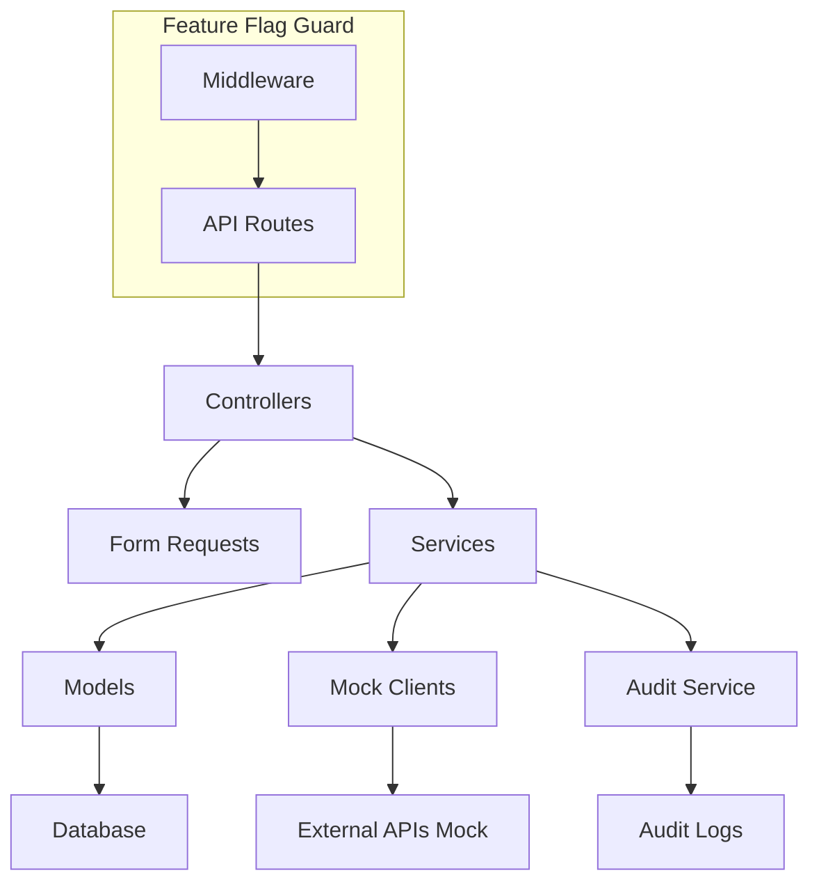

# Design Document

## Overview

Module M01: Profil Pelanggan implements user registration, identity verification, company management, and account lifecycle management for the OSC Pelesenan PBT system. The design follows Laravel conventions with clean architecture principles, featuring mock external service integrations, comprehensive audit logging, and feature flag controls.

## Architecture

### High-Level Architecture



### Layer Responsibilities

- **Controllers**: Handle HTTP requests, delegate to services, return API responses
- **Form Requests**: Validate incoming request data
- **Services**: Business logic orchestration and external service coordination
- **Models**: Data access layer with Eloquent relationships
- **Mock Clients**: Simulate external service integrations (KPKT Hub, JPN, MyDigital, SSM)
- **Audit Service**: Centralized audit logging for all mutations
- **Policies**: Authorization logic for resource access control

## Components and Interfaces

### Controllers

#### AuthController
- `POST /api/auth/register` - User registration with validation
- `POST /api/auth/login` - User authentication with token generation

#### ProfileController  
- `POST /api/profile/verify-identity` - Identity verification via mock adapters

#### CompanyController
- `POST /api/company/verify-ssm` - SSM verification and company creation/update
- `POST /api/company/link` - Link user to company ownership

#### AccountController
- `POST /api/account/deactivate` - Soft delete user and revoke tokens

### Services

#### AuthService
```php
class AuthService
{
    public function register(array $data): User
    public function login(array $credentials): string // returns token
    private function createAuditLog(string $action, User $user): void
}
```

#### IdentityVerificationService
```php
class IdentityVerificationService
{
    public function __construct(private MockIdentityClient $client) {}
    
    public function verifyIdentity(User $user, string $icNo): bool
    private function updateVerificationStatus(User $user, bool $verified): void
}
```

#### CompanyService
```php
class CompanyService
{
    public function __construct(private MockSSMClient $client) {}
    
    public function verifyAndCreateCompany(string $ssmNo): Company
    public function linkUserToCompany(User $user, int $companyId): void
    private function createOrUpdateCompany(string $ssmNo, string $status): Company
}
```

#### AccountService
```php
class AccountService
{
    public function deactivateAccount(User $user): void
    private function revokeAllTokens(User $user): void
}
```

### Mock Clients

#### MockIdentityClient
```php
class MockIdentityClient
{
    public function verify(string $icNo): IdentityVerificationResult
    
    // Mock logic: IC ending with even digit = verified
    private function mockVerificationLogic(string $icNo): bool
}
```

#### MockSSMClient
```php
class MockSSMClient
{
    public function checkCompanyStatus(string $ssmNo): CompanyStatusResult
    
    // Mock logic: SSM starting with "SSM-" = active
    private function mockStatusLogic(string $ssmNo): string
}
```

### Audit Service

#### AuditService
```php
class AuditService
{
    public function log(string $action, string $entityType, int $entityId, array $meta = []): void
    public function logUserAction(User $actor, string $action, Model $entity, array $meta = []): void
}
```

## Data Models

### User Model
```php
class User extends Authenticatable
{
    protected $fillable = ['name', 'email', 'password', 'ic_no', 'role'];
    protected $casts = [
        'status_verified_person' => 'boolean',
        'email_verified_at' => 'datetime',
        'deleted_at' => 'datetime'
    ];
    
    // Relationships
    public function ownedCompanies(): HasMany
    public function auditLogs(): HasMany
    
    // Scopes
    public function scopeVerified($query)
    public function scopeActive($query)
}
```

### Company Model
```php
class Company extends Model
{
    protected $fillable = ['ssm_no', 'name', 'status', 'owner_user_id'];
    protected $casts = [
        'status' => CompanyStatus::class // Enum: active, inactive, unknown
    ];
    
    // Relationships
    public function owner(): BelongsTo
    public function auditLogs(): MorphMany
}
```

### AuditLog Model
```php
class AuditLog extends Model
{
    protected $fillable = ['actor_id', 'action', 'entity_type', 'entity_id', 'meta'];
    protected $casts = [
        'meta' => 'array',
        'created_at' => 'datetime'
    ];
    
    // Relationships
    public function actor(): BelongsTo
    public function entity(): MorphTo
}
```

## Database Schema

### Migration: users table
```sql
CREATE TABLE users (
    id BIGINT UNSIGNED AUTO_INCREMENT PRIMARY KEY,
    name VARCHAR(255) NOT NULL,
    email VARCHAR(255) UNIQUE NOT NULL,
    password VARCHAR(255) NOT NULL,
    ic_no VARCHAR(20) UNIQUE NOT NULL,
    status_verified_person BOOLEAN DEFAULT FALSE,
    role ENUM('PEMOHON', 'PENTADBIR_SYS') DEFAULT 'PEMOHON',
    email_verified_at TIMESTAMP NULL,
    deleted_at TIMESTAMP NULL,
    created_at TIMESTAMP DEFAULT CURRENT_TIMESTAMP,
    updated_at TIMESTAMP DEFAULT CURRENT_TIMESTAMP ON UPDATE CURRENT_TIMESTAMP
);
```

### Migration: companies table
```sql
CREATE TABLE companies (
    id BIGINT UNSIGNED AUTO_INCREMENT PRIMARY KEY,
    ssm_no VARCHAR(50) UNIQUE NOT NULL,
    name VARCHAR(255) NOT NULL,
    status ENUM('active', 'inactive', 'unknown') DEFAULT 'unknown',
    owner_user_id BIGINT UNSIGNED NULL,
    created_at TIMESTAMP DEFAULT CURRENT_TIMESTAMP,
    updated_at TIMESTAMP DEFAULT CURRENT_TIMESTAMP ON UPDATE CURRENT_TIMESTAMP,
    FOREIGN KEY (owner_user_id) REFERENCES users(id) ON DELETE SET NULL
);
```

### Migration: audit_logs table
```sql
CREATE TABLE audit_logs (
    id BIGINT UNSIGNED AUTO_INCREMENT PRIMARY KEY,
    actor_id BIGINT UNSIGNED NULL,
    action VARCHAR(100) NOT NULL,
    entity_type VARCHAR(100) NOT NULL,
    entity_id BIGINT UNSIGNED NOT NULL,
    meta JSON NULL,
    created_at TIMESTAMP DEFAULT CURRENT_TIMESTAMP,
    FOREIGN KEY (actor_id) REFERENCES users(id) ON DELETE SET NULL
);
```

## API Contracts

### Authentication Endpoints

#### POST /api/auth/register
```json
Request: {
    "name": "string|required|max:255",
    "email": "string|required|email|unique:users",
    "password": "string|required|min:8|confirmed",
    "ic_no": "string|required|unique:users|regex:/^[0-9]{12}$/"
}

Response 201: {
    "user": {
        "id": 1,
        "name": "John Doe",
        "email": "john@example.com",
        "ic_no": "123456789012",
        "status_verified_person": false,
        "role": "PEMOHON"
    },
    "token": "sanctum_token_string"
}
```

#### POST /api/auth/login
```json
Request: {
    "email": "string|required|email",
    "password": "string|required"
}

Response 200: {
    "user": { /* user object */ },
    "token": "sanctum_token_string"
}
```

### Profile Endpoints

#### POST /api/profile/verify-identity
```json
Request: {
    "ic_no": "string|required|regex:/^[0-9]{12}$/"
}

Response 200: {
    "verified": true,
    "message": "Identity verification successful"
}
```

### Company Endpoints

#### POST /api/company/verify-ssm
```json
Request: {
    "ssm_no": "string|required|max:50"
}

Response 200: {
    "company": {
        "id": 1,
        "ssm_no": "SSM-123456",
        "name": "Example Sdn Bhd",
        "status": "active"
    }
}
```

#### POST /api/company/link
```json
Request: {
    "company_id": "integer|required|exists:companies,id"
}

Response 200: {
    "message": "Company linked successfully",
    "company": { /* company object */ }
}
```

### Account Endpoints

#### POST /api/account/deactivate
```json
Response 200: {
    "message": "Account deactivated successfully"
}
```

## Authorization & Security

### Policies

#### CompanyPolicy
```php
class CompanyPolicy
{
    public function link(User $user, Company $company): bool
    {
        return $company->owner_user_id === null || $user->role === 'PENTADBIR_SYS';
    }
    
    public function viewAny(User $user): bool
    {
        return $user->role === 'PENTADBIR_SYS';
    }
}
```

### Middleware Stack
- `auth:sanctum` - Authentication via Sanctum tokens
- `FeatureFlagMiddleware` - Module M01 feature flag validation
- `throttle:api` - Rate limiting for API endpoints

## Error Handling

### Standard Error Responses
```json
// Validation Error (422)
{
    "message": "The given data was invalid.",
    "errors": {
        "email": ["The email field is required."]
    }
}

// Authentication Error (401)
{
    "message": "Unauthenticated."
}

// Authorization Error (403)
{
    "message": "This action is unauthorized."
}

// Feature Disabled (404)
{
    "message": "Not Found."
}
```

### Exception Handling Strategy
- Custom exception classes for business logic errors
- Global exception handler for consistent API responses
- Logging of all exceptions for debugging
- Graceful degradation when external services fail

## Testing Strategy

### Test Categories

#### Feature Tests (Pest)
- Authentication flow tests (register, login, logout)
- Identity verification endpoint tests
- Company verification and linking tests
- Account deactivation tests
- Authorization policy tests

#### Unit Tests (Pest)
- Service class method testing
- Mock client behavior validation
- Model relationship and scope testing
- Audit logging functionality

#### Contract Tests
- MockIdentityClient verification scenarios
- MockSSMClient status check scenarios
- Edge cases and error conditions

### Test Data Strategy
- Database seeders for consistent test data
- Factory classes for model generation
- Mock service responses for external dependencies

## Feature Flag Implementation

### Environment Configuration
```env
MODULE_M01=true
MODULE_M02=false
# ... other modules default to false
```

### Middleware Implementation
```php
class FeatureFlagMiddleware
{
    public function handle(Request $request, Closure $next, string $module): Response
    {
        if (!config("features.{$module}", false)) {
            abort(404);
        }
        
        return $next($request);
    }
}
```

### Route Protection
```php
Route::middleware(['auth:sanctum', 'feature:MODULE_M01'])->group(function () {
    // All M01 routes protected by feature flag
});
```

## Performance Considerations

- Database indexing on frequently queried fields (email, ic_no, ssm_no)
- Eager loading for relationships to prevent N+1 queries
- Caching for feature flag checks
- Audit log partitioning for large-scale deployments
- Rate limiting on authentication endpoints

## Security Measures

- Password hashing with Laravel's default bcrypt
- Input validation and sanitization
- CSRF protection for web routes
- SQL injection prevention via Eloquent ORM
- Audit trail for compliance and security monitoring
- Soft deletes to maintain data integrity