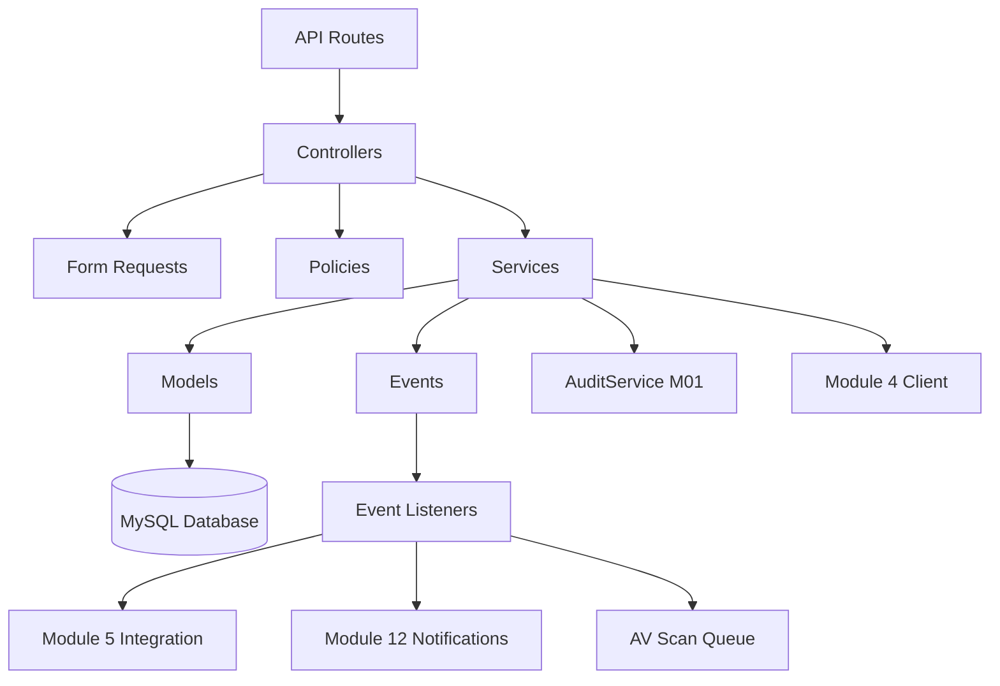

# Design Document

## Module M02 – Permohonan Lesen oleh Pemohon

---

## Overview

Module M02 enables verified Pemohon to create, manage, and submit license applications through a RESTful API. The module integrates with:

- **Module M01** for authentication, user/company data, and audit logging
- **Module 4** for dynamic license type catalog and document requirements
- **Module 5** for forwarding submitted applications to PBT review queue
- **Module 10** for payment processing (out of scope for M02)
- **Module 12** for email/SMS notifications

The design follows Laravel 10 conventions with service-oriented architecture, policy-based authorization, and event-driven integration points.

---

## Architecture

### High-Level Component Diagram



### Layer Responsibilities

| Layer | Responsibility |
|:--|:--|
| **Routes** | Define API endpoints with feature flag middleware |
| **Controllers** | Handle HTTP requests, delegate to services, return JSON responses |
| **Form Requests** | Validate input data for applications and document uploads |
| **Policies** | Enforce ownership and status-based authorization rules |
| **Services** | Contain business logic for CRUD, validation, and submission workflows |
| **Models** | Define Eloquent relationships, scopes, and database interactions |
| **Events** | Decouple integration points (submission, document upload) |
| **Listeners** | Handle event-driven tasks (notifications, queue forwarding, AV scanning) |
| **AuditService** | Reused from M01 to log all mutations |

---

## Database Schema

### Tables

#### `permohonan` (License Applications)

```sql
CREATE TABLE permohonan (
    id CHAR(36) PRIMARY KEY,
    user_id BIGINT UNSIGNED NOT NULL,
    company_id BIGINT UNSIGNED NOT NULL,
    jenis_lesen_id BIGINT UNSIGNED NOT NULL,
    status ENUM('Draf', 'Diserahkan', 'Dibatalkan') DEFAULT 'Draf',
    tarikh_serahan DATETIME NULL,
    butiran_operasi JSON NULL COMMENT 'Business details including alamat_premis',
    created_at TIMESTAMP DEFAULT CURRENT_TIMESTAMP,
    updated_at TIMESTAMP DEFAULT CURRENT_TIMESTAMP ON UPDATE CURRENT_TIMESTAMP,
    
    FOREIGN KEY (user_id) REFERENCES users(id) ON DELETE RESTRICT,
    FOREIGN KEY (company_id) REFERENCES companies(id) ON DELETE RESTRICT,
    
    INDEX idx_user_id (user_id),
    INDEX idx_company_id (company_id),
    INDEX idx_jenis_lesen_id (jenis_lesen_id),
    INDEX idx_status (status),
    INDEX idx_tarikh_serahan (tarikh_serahan),
    INDEX idx_created_at (created_at)
) ENGINE=InnoDB DEFAULT CHARSET=utf8mb4 COLLATE=utf8mb4_unicode_ci;
```

**JSON Structure for `butiran_operasi`:**

```json
{
  "alamat_premis": {
    "alamat_1": "string",
    "alamat_2": "string|null",
    "bandar": "string",
    "poskod": "string",
    "negeri": "string"
  },
  "nama_perniagaan": "string",
  "jenis_operasi": "string",
  "bilangan_pekerja": "integer|null",
  "catatan": "string|null"
}
```

#### `permohonan_dokumen` (Application Documents)

```sql
CREATE TABLE permohonan_dokumen (
    id CHAR(36) PRIMARY KEY,
    permohonan_id CHAR(36) NOT NULL,
    keperluan_dokumen_id BIGINT UNSIGNED NOT NULL COMMENT 'From Module 4',
    nama_fail VARCHAR(255) NOT NULL,
    mime VARCHAR(100) NOT NULL,
    saiz_bait BIGINT UNSIGNED NOT NULL,
    url_storan VARCHAR(500) NOT NULL,
    hash_fail VARCHAR(128) NULL COMMENT 'Optional integrity hash (SHA-256)',
    status_sah ENUM('BelumSah', 'Disahkan') DEFAULT 'BelumSah',
    uploaded_by BIGINT UNSIGNED NOT NULL,
    created_at TIMESTAMP DEFAULT CURRENT_TIMESTAMP,
    
    FOREIGN KEY (permohonan_id) REFERENCES permohonan(id) ON DELETE CASCADE,
    FOREIGN KEY (uploaded_by) REFERENCES users(id) ON DELETE RESTRICT,
    
    INDEX idx_permohonan_id (permohonan_id),
    INDEX idx_keperluan_dokumen_id (keperluan_dokumen_id),
    INDEX idx_status_sah (status_sah),
    UNIQUE KEY unique_keperluan_per_permohonan (permohonan_id, keperluan_dokumen_id)
) ENGINE=InnoDB DEFAULT CHARSET=utf8mb4 COLLATE=utf8mb4_unicode_ci;
```

---

## API Endpoints

### Application Management

| Method | Endpoint | Description | Auth | Policy |
|:--|:--|:--|:--|:--|
| POST | `/api/m02/permohonan` | Create new draft application | Required | - |
| GET | `/api/m02/permohonan` | List user's applications (paginated, filterable) | Required | - |
| GET | `/api/m02/permohonan/{id}` | View application details | Required | `view` |
| PUT | `/api/m02/permohonan/{id}` | Update draft application | Required | `update` |
| POST | `/api/m02/permohonan/{id}/submit` | Submit application to PBT | Required | `submit` |
| POST | `/api/m02/permohonan/{id}/cancel` | Cancel draft application | Required | `cancel` |

### Document Management

| Method | Endpoint | Description | Auth | Policy |
|:--|:--|:--|:--|:--|
| POST | `/api/m02/permohonan/{id}/dokumen` | Upload document | Required | `update` |
| DELETE | `/api/m02/permohonan/{id}/dokumen/{dokumenId}` | Delete document (draft only) | Required | `update` |

### Query Parameters for List Endpoint

- `status` (string): Filter by status (Draf, Diserahkan, Dibatalkan)
- `jenis_lesen_id` (integer): Filter by license type
- `tarikh_dari` (date): Filter by submission date from
- `tarikh_hingga` (date): Filter by submission date to
- `page` (integer): Page number (default: 1)
- `per_page` (integer): Items per page (default: 15, max: 100)

---

## Models

### `Permohonan` Model

```php
namespace App\Models\M02;

use App\Models\User;
use App\Models\M01\Company;
use Illuminate\Database\Eloquent\Model;
use Illuminate\Database\Eloquent\Concerns\HasUuids;

class Permohonan extends Model
{
    use HasUuids;

    protected $table = 'permohonan';
    
    protected $fillable = [
        'user_id',
        'company_id',
        'jenis_lesen_id',
        'status',
        'tarikh_serahan',
        'butiran_operasi',
    ];
    
    protected $casts = [
        'butiran_operasi' => 'array',
        'tarikh_serahan' => 'datetime',
    ];
    
    // Relationships
    public function user() { return $this->belongsTo(User::class); }
    public function company() { return $this->belongsTo(Company::class); }
    public function dokumen() { return $this->hasMany(PermohonanDokumen::class); }
    
    // Scopes
    public function scopeDraf($query) { return $query->where('status', 'Draf'); }
    public function scopeDiserahkan($query) { return $query->where('status', 'Diserahkan'); }
    public function scopeForUser($query, $userId) { return $query->where('user_id', $userId); }
    
    // Status checks
    public function isDraf(): bool { return $this->status === 'Draf'; }
    public function isDiserahkan(): bool { return $this->status === 'Diserahkan'; }
}
```

### `PermohonanDokumen` Model

```php
namespace App\Models\M02;

use App\Models\User;
use Illuminate\Database\Eloquent\Model;
use Illuminate\Database\Eloquent\Concerns\HasUuids;

class PermohonanDokumen extends Model
{
    use HasUuids;

    protected $table = 'permohonan_dokumen';
    
    protected $fillable = [
        'permohonan_id',
        'keperluan_dokumen_id',
        'nama_fail',
        'mime',
        'saiz_bait',
        'url_storan',
        'hash_fail',
        'status_sah',
        'uploaded_by',
    ];
    
    // Relationships
    public function permohonan() { return $this->belongsTo(Permohonan::class); }
    public function uploader() { return $this->belongsTo(User::class, 'uploaded_by'); }
}
```

---

## Services

### `PermohonanService`

**Responsibilities:**
- Create draft applications with pre-populated user/company data
- Update draft applications
- Validate completeness before submission
- Submit applications (status change, event emission)
- Cancel draft applications
- Coordinate with AuditService for all mutations

**Key Methods:**

```php
namespace App\Services\M02;

class PermohonanService
{
    public function __construct(
        private AuditService $auditService,
        private Module4Client $module4Client
    ) {}
    
    public function createDraft(User $user, array $data): Permohonan
    {
        // Validate company_id belongs to user
        // Validate jenis_lesen_id exists via Module4Client
        // Pre-populate user and company info
        // Create permohonan with status 'Draf'
        // Log via AuditService
    }
    
    public function updateDraft(Permohonan $permohonan, array $data): Permohonan
    {
        // Validate status is 'Draf'
        // If company_id is being changed, validate it belongs to user
        // If jenis_lesen_id is being changed, validate it exists via Module4Client
        // Update fields
        // Log via AuditService
    }
    
    public function validateCompleteness(Permohonan $permohonan): array
    {
        // Check all mandatory fields
        // Validate alamat_premis exists in butiran_operasi
        // Fetch keperluan_dokumen from Module 4 (cached)
        // Verify all required documents uploaded
        // Return validation errors or empty array
    }
    
    public function submit(Permohonan $permohonan): Permohonan
    {
        // Validate completeness
        // Change status to 'Diserahkan'
        // Set tarikh_serahan
        // Emit PermohonanDiserahkan event
        // Log via AuditService
    }
    
    public function cancel(Permohonan $permohonan, string $reason): Permohonan
    {
        // Validate status is 'Draf'
        // Change status to 'Dibatalkan'
        // Log via AuditService with reason
    }
}
```

### `DokumenService`

**Responsibilities:**
- Handle file uploads with validation
- Store files to configured filesystem
- Compute optional integrity hash
- Create permohonan_dokumen records
- Emit DokumenDimuatNaik event
- Delete documents (draft only)

**Key Methods:**

```php
namespace App\Services\M02;

class DokumenService
{
    public function __construct(
        private AuditService $auditService
    ) {}
    
    public function upload(
        Permohonan $permohonan,
        int $keperluanDokumenId,
        UploadedFile $file,
        User $uploader
    ): PermohonanDokumen
    {
        // Validate file type (PDF, JPG, JPEG, PNG)
        // Validate file size <= config('files.max_upload_size')
        // Check if document already exists for this keperluan_dokumen_id
        // If exists, delete old file and replace record
        // Store file to filesystem
        // Compute hash if enabled
        // Create permohonan_dokumen record
        // Emit DokumenDimuatNaik event
        // Log via AuditService
    }
    
    public function delete(PermohonanDokumen $dokumen): void
    {
        // Validate permohonan is 'Draf'
        // Validate document status_sah is 'BelumSah' (cannot delete validated documents)
        // Delete file from storage
        // Delete database record
        // Log via AuditService
    }
}
```

### `Module4Client`

**Responsibilities:**
- Fetch jenis_lesen catalog from Module 4
- Fetch keperluan_dokumen for a specific jenis_lesen_id
- Cache responses for 15 minutes
- Provide dev fallback when Module 4 unavailable

**Key Methods:**

```php
namespace App\Services\M02;

class Module4Client
{
    public function getJenisLesen(): Collection
    {
        // Fetch from Module 4 API
        // Cache for 15 minutes
        // Return dev fallback if unavailable in dev environment
    }
    
    public function getKeperluanDokumen(int $jenisLesenId): Collection
    {
        // Fetch from Module 4 API
        // Cache for 15 minutes (key: "keperluan_dokumen:{$jenisLesenId}")
        // Return dev fallback if unavailable in dev environment
    }
}
```

---

## Policies

### `PermohonanPolicy`

**Authorization Rules:**

```php
namespace App\Policies\M02;

class PermohonanPolicy
{
    public function view(User $user, Permohonan $permohonan): bool
    {
        return $permohonan->user_id === $user->id;
    }
    
    public function update(User $user, Permohonan $permohonan): bool
    {
        return $permohonan->user_id === $user->id 
            && $permohonan->isDraf();
    }
    
    public function submit(User $user, Permohonan $permohonan): bool
    {
        return $permohonan->user_id === $user->id 
            && $permohonan->isDraf()
            && $user->status_verified_person === 'Verified';
    }
    
    public function cancel(User $user, Permohonan $permohonan): bool
    {
        return $permohonan->user_id === $user->id 
            && $permohonan->isDraf();
    }
}
```

---

## Events and Listeners

### `PermohonanDiserahkan` Event

**Payload:**
- `permohonan` (Permohonan model)

**Listeners:**
1. **ForwardToModule5Listener** - Forwards application to PBT review queue
2. **SendSubmissionNotificationListener** - Triggers Module 12 email/SMS

### `DokumenDimuatNaik` Event

**Payload:**
- `permohonanDokumen` (PermohonanDokumen model)

**Listeners:**
1. **QueueAntivirusScanListener** - Queues AV scan job if enabled

---

## Form Requests

### `CreatePermohonanRequest`

**Validation Rules:**
```php
[
    'company_id' => [
        'required',
        'exists:companies,id',
        // Custom rule to verify company belongs to authenticated user
        new CompanyOwnershipRule(auth()->user())
    ],
    'jenis_lesen_id' => 'required|integer',
    'butiran_operasi' => 'required|array',
    'butiran_operasi.alamat_premis' => 'required|array',
    'butiran_operasi.alamat_premis.alamat_1' => 'required|string|max:255',
    'butiran_operasi.alamat_premis.bandar' => 'required|string|max:100',
    'butiran_operasi.alamat_premis.poskod' => 'required|string|max:10',
    'butiran_operasi.alamat_premis.negeri' => 'required|string|max:100',
    'butiran_operasi.nama_perniagaan' => 'required|string|max:255',
]
```

### `UpdatePermohonanRequest`

Same as CreatePermohonanRequest but all fields optional.

### `UploadDokumenRequest`

**Validation Rules:**
```php
[
    'keperluan_dokumen_id' => 'required|integer',
    'file' => [
        'required',
        'file',
        'mimes:pdf,jpg,jpeg,png',
        'max:' . (int) (config('files.max_upload_size') / 1024) // Convert bytes to integer KB
    ],
]
```

---

## Controllers

### `PermohonanController`

**Methods:**

```php
namespace App\Http\Controllers\M02;

class PermohonanController extends Controller
{
    public function __construct(
        private PermohonanService $permohonanService
    ) {
        $this->middleware(['auth:sanctum', 'feature:MODULE_M02', 'throttle:60,1']);
    }
    
    public function index(Request $request): JsonResponse
    {
        // Get authenticated user
        // Apply filters (status, jenis_lesen_id, date range)
        // Default sort: created_at DESC
        // Paginate results
        // Return JSON
    }
    
    public function store(CreatePermohonanRequest $request): JsonResponse
    {
        // Delegate to service
        // Return 201 with created resource
    }
    
    public function show(Permohonan $permohonan): JsonResponse
    {
        // Authorize via policy
        // Load relationships (dokumen, company)
        // Return JSON
    }
    
    public function update(UpdatePermohonanRequest $request, Permohonan $permohonan): JsonResponse
    {
        // Authorize via policy
        // Delegate to service
        // Return 200 with updated resource
    }
    
    public function submit(Permohonan $permohonan): JsonResponse
    {
        // Authorize via policy
        // Delegate to service
        // Return 200 with success message
    }
    
    public function cancel(Request $request, Permohonan $permohonan): JsonResponse
    {
        // Authorize via policy
        // Validate reason in request
        // Delegate to service
        // Return 200 with success message
    }
}
```

### `DokumenController`

**Methods:**

```php
namespace App\Http\Controllers\M02;

class DokumenController extends Controller
{
    public function __construct(
        private DokumenService $dokumenService
    ) {
        $this->middleware(['auth:sanctum', 'feature:MODULE_M02', 'throttle:30,1']);
    }
    
    public function store(UploadDokumenRequest $request, Permohonan $permohonan): JsonResponse
    {
        // Authorize permohonan update via policy
        // Delegate to service
        // Return 201 with created resource
    }
    
    public function destroy(Permohonan $permohonan, PermohonanDokumen $dokumen): JsonResponse
    {
        // Authorize permohonan update via policy
        // Verify dokumen belongs to permohonan
        // Delegate to service
        // Return 204
    }
}
```

---

## Configuration

### Environment Variables

```env
# Module M02 Feature Flag
MODULE_M02=true

# File Upload Settings
FILESYSTEM_DISK=local
MAX_UPLOAD_SIZE=10485760  # 10 MB in bytes
FILE_INTEGRITY_HASH_ENABLED=false

# Module 4 Integration
MODULE_4_BASE_URL=http://module4-service/api
MODULE_4_CACHE_TTL=900  # 15 minutes

# Antivirus Scanning
AV_SCAN_ENABLED=false
AV_SCAN_QUEUE=av-scans
```

### Config File: `config/m02.php`

```php
return [
    'enabled' => env('MODULE_M02', false),
    
    'files' => [
        'disk' => env('FILESYSTEM_DISK', 'local'),
        'max_upload_size' => env('MAX_UPLOAD_SIZE', 10 * 1024 * 1024),
        'allowed_mimes' => ['pdf', 'jpg', 'jpeg', 'png'],
        'integrity_hash_enabled' => env('FILE_INTEGRITY_HASH_ENABLED', false),
    ],
    
    'module4' => [
        'base_url' => env('MODULE_4_BASE_URL'),
        'cache_ttl' => env('MODULE_4_CACHE_TTL', 900),
    ],
    
    'antivirus' => [
        'enabled' => env('AV_SCAN_ENABLED', false),
        'queue' => env('AV_SCAN_QUEUE', 'av-scans'),
    ],
];
```

---

## Error Handling

### Custom Exceptions

```php
namespace App\Exceptions\M02;

class PermohonanNotDrafException extends \Exception
{
    public function render()
    {
        return response()->json([
            'error' => 'Application must be in draft status for this operation'
        ], 422);
    }
}

class PermohonanIncompleteException extends \Exception
{
    public function __construct(public array $errors)
    {
        parent::__construct('Application is incomplete');
    }
    
    public function render()
    {
        return response()->json([
            'error' => 'Application is incomplete',
            'validation_errors' => $this->errors
        ], 422);
    }
}

class InvalidFileTypeException extends \Exception
{
    public function render()
    {
        return response()->json([
            'error' => 'File type not allowed. Allowed types: PDF, JPG, JPEG, PNG'
        ], 422);
    }
}

class FileSizeExceededException extends \Exception
{
    public function render()
    {
        return response()->json([
            'error' => 'File size exceeds maximum allowed size'
        ], 422);
    }
}

class CompanyNotOwnedException extends \Exception
{
    public function render()
    {
        return response()->json([
            'error' => 'Company does not belong to authenticated user'
        ], 403);
    }
}

class IdentityNotVerifiedException extends \Exception
{
    public function render()
    {
        return response()->json([
            'error' => 'User identity must be verified before submitting applications'
        ], 403);
    }
}

class DocumentAlreadyValidatedException extends \Exception
{
    public function render()
    {
        return response()->json([
            'error' => 'Cannot delete a validated document'
        ], 422);
    }
}
```

---

## Testing Strategy

### Unit Tests

1. **PermohonanService Tests**
   - Test draft creation with pre-populated data
   - Test update validation (status must be Draf)
   - Test completeness validation logic
   - Test submission workflow
   - Test cancellation workflow

2. **DokumenService Tests**
   - Test file validation (type and size)
   - Test hash computation when enabled
   - Test event emission
   - Test deletion restrictions

3. **Module4Client Tests**
   - Test caching behavior
   - Test dev fallback
   - Mock HTTP responses

### Feature Tests

1. **Application CRUD Tests**
   - POST /api/m02/permohonan (create draft)
   - GET /api/m02/permohonan (list with filters)
   - GET /api/m02/permohonan/{id} (view details)
   - PUT /api/m02/permohonan/{id} (update draft)
   - POST /api/m02/permohonan/{id}/submit (submit)
   - POST /api/m02/permohonan/{id}/cancel (cancel)

2. **Document Upload Tests**
   - POST /api/m02/permohonan/{id}/dokumen (upload)
   - DELETE /api/m02/permohonan/{id}/dokumen/{dokumenId} (delete)
   - Test file type validation
   - Test file size validation

3. **Authorization Tests**
   - Test ownership enforcement
   - Test status-based restrictions
   - Test feature flag middleware

### Integration Tests

1. **Module 4 Integration**
   - Test fetching jenis_lesen catalog
   - Test fetching keperluan_dokumen
   - Test cache behavior

2. **Event-Driven Integration**
   - Test PermohonanDiserahkan event triggers Module 5 forwarding
   - Test PermohonanDiserahkan event triggers Module 12 notification
   - Test DokumenDimuatNaik event triggers AV scan queue

3. **Audit Logging**
   - Verify all mutations logged via AuditService
   - Verify log format consistency with M01

---

## Development Seeders

### `JenisLesenSeeder`

```php
namespace Database\Seeders\M02;

class JenisLesenSeeder extends Seeder
{
    public function run()
    {
        // Only run in non-production
        if (app()->environment('production')) {
            return;
        }
        
        DB::table('jenis_lesen')->insert([
            ['id' => 1, 'kod' => 'SAMPLE-01', 'nama' => 'Sample License Type 1'],
            ['id' => 2, 'kod' => 'SAMPLE-02', 'nama' => 'Sample License Type 2'],
        ]);
    }
}
```

### `KeperluanDokumenSeeder`

```php
namespace Database\Seeders\M02;

class KeperluanDokumenSeeder extends Seeder
{
    public function run()
    {
        // Only run in non-production
        if (app()->environment('production')) {
            return;
        }
        
        DB::table('keperluan_dokumen')->insert([
            ['id' => 1, 'jenis_lesen_id' => 1, 'nama' => 'SSM Registration', 'wajib' => true],
            ['id' => 2, 'jenis_lesen_id' => 1, 'nama' => 'Business Photo', 'wajib' => true],
            ['id' => 3, 'jenis_lesen_id' => 2, 'nama' => 'Competency Certificate', 'wajib' => true],
        ]);
    }
}
```

---

## Security Considerations

1. **Authentication**: All endpoints require Sanctum authentication
2. **Authorization**: 
   - Policies enforce ownership and status-based access
   - Submission requires verified identity (status_verified_person = 'Verified')
   - Company ownership validated on create/update operations
3. **File Upload Security**:
   - Whitelist allowed MIME types
   - Enforce file size limits
   - Store files outside public directory
   - Optional AV scanning via queued jobs
   - Optional integrity hashing for tamper detection
   - Prevent deletion of validated documents
4. **Input Validation**: Form requests validate all user input
5. **SQL Injection**: Eloquent ORM prevents SQL injection
6. **Feature Flag**: MODULE_M02 controls module activation
7. **Rate Limiting**: 
   - Document upload endpoints: 30 requests/minute
   - Application mutation endpoints: 60 requests/minute

---

## Performance Considerations

1. **Caching**: Module 4 responses cached for 15 minutes
2. **Pagination**: Application lists paginated (default 15, max 100)
3. **Indexes**: 
   - Database indexes on FKs, status, created_at, and tarikh_serahan
   - Unique constraint on (permohonan_id, keperluan_dokumen_id) prevents duplicate uploads
4. **Eager Loading**: Load relationships to avoid N+1 queries
5. **Queue Jobs**: AV scanning runs asynchronously
6. **Default Sorting**: Application lists default to created_at DESC for optimal index usage

---

## Deployment Checklist

- [ ] Run migrations for permohonan and permohonan_dokumen tables
- [ ] Set MODULE_M02=true in environment
- [ ] Configure file storage disk and max upload size
- [ ] Configure Module 4 base URL and cache TTL
- [ ] Configure AV scanning if required
- [ ] Register policies in AuthServiceProvider
- [ ] Register event listeners in EventServiceProvider
- [ ] Run seeders in development environments only
- [ ] Verify Module 5 and Module 12 integration endpoints
- [ ] Test feature flag middleware
- [ ] Verify audit logging integration with M01

---

## Operational Resilience

### Event Dispatch Failures

- **PermohonanDiserahkan Event**: If Module 5 forwarding or Module 12 notification fails, the application status remains 'Diserahkan' and the failure is logged via AuditService
- **Retry Strategy**: Event listeners should implement exponential backoff (3 retries: 1s, 5s, 15s)
- **Dead Letter Queue**: Failed events after max retries are moved to a dead letter queue for manual review

### Antivirus Scan Jobs

- **Queue Configuration**: AV scan jobs run on dedicated queue with timeout of 5 minutes
- **Retry Strategy**: Failed scans retry 3 times with exponential backoff
- **Failure Handling**: If scan fails after retries, document status_sah remains 'BelumSah' and admin is notified
- **Success/Failure Logging**: Both scan outcomes are logged via AuditService

### Module 4 Integration Resilience

- **Timeout**: HTTP requests to Module 4 timeout after 10 seconds
- **Fallback**: In development environments, use seeded fallback data when Module 4 is unavailable
- **Production Behavior**: In production, Module 4 unavailability returns 503 Service Unavailable error
- **Cache Strategy**: Cache reduces dependency on Module 4 availability for repeated requests

## Module 4 Referential Integrity

**Note**: Module 4 is an external service with its own database. Therefore:

- **No FK Constraint**: The `jenis_lesen_id` field in `permohonan` table does NOT have a foreign key constraint
- **Validation Strategy**: `jenis_lesen_id` is validated via Module4Client before creating/updating applications
- **Cache Benefit**: Cached catalog data reduces validation latency and Module 4 dependency
- **Error Handling**: If jenis_lesen_id is invalid, Module4Client returns validation error before database write

## Policy Behavior Clarification

### View Policy
- **Draft Applications**: Owner can view
- **Submitted Applications**: Owner can view (read-only)
- **Cancelled Applications**: Owner can view (read-only)

### Update Policy
- **Draft Applications**: Owner can update
- **Submitted Applications**: Owner CANNOT update (blocked by policy)
- **Cancelled Applications**: Owner CANNOT update (blocked by policy)

**Rationale**: Once an application is submitted, it enters PBT review workflow and should not be modified by the applicant. Viewing is allowed for transparency and record-keeping.

## UI Label Conventions

**Status Display in Frontend:**
- Backend state after submission is **'Diserahkan'**
- Frontend may display the label **"Permohonan Baru"** for recently submitted applications in list views
- This is purely a presentation-layer label for user clarity and does not affect backend state
- Ensures consistency with Module 2 visual terminology and user expectations

## Development Seeders Ownership

**Important**: The `JenisLesenSeeder` and `KeperluanDokumenSeeder` are provided in Module M02 for development convenience only. In production:

- License catalog data is managed exclusively by **Module 4**
- Module M02 does not seed or modify catalog data
- Seeders are disabled in production environments via environment check
- This maintains clear separation of concerns between modules

## Future Enhancements

1. **Document Versioning**: Allow document replacement with version history
2. **Application Templates**: Save common application data as templates
3. **Bulk Operations**: Support bulk cancellation or status updates
4. **Advanced Search**: Full-text search on business details
5. **Document Preview**: Generate thumbnails for uploaded images
6. **Workflow Automation**: Auto-submit when all documents uploaded
